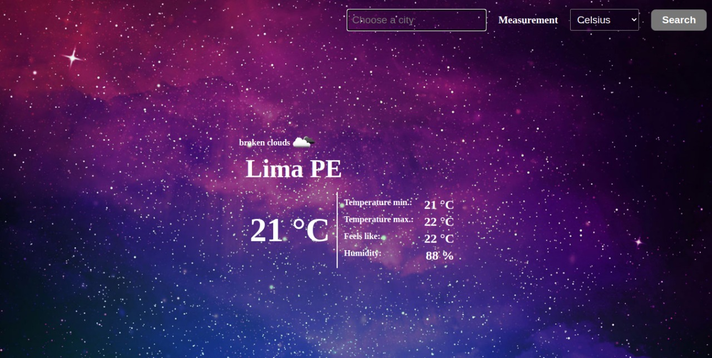

# LaReserva_Restaurant

> Thi is a webapp made to show the temperature in the city you enter through the input. This app uses opweather API in order to get the information.

## :red_circle: Live Demo:

[Live Demo Link](https://kcotrinam.github.io/weather-app/)

## :hammer: Built with

- HTML5
- CSS3
- SCSS
- JavaScript
- Webpack
- Linters
- VS code

## :construction_worker: Getting Started

To get a local copy up and running follow these simple steps:

1. Go to the [repository page](https://github.com/kcotrinam/weather-app/).
2. Press the "Code" button and copy the link.
3. Clone it using git command `git clone <link>`.

## :construction_worker: How to use to

1. Move to the folder: `cd weather-app`.
2. run `npm install`.
3. on your command line run: `npm run dev` (development) or `npm run build` (Production).
4. start server:
  4.1 [live server](https://marketplace.visualstudio.com/items?itemName=ritwickdey.LiveServer) can be used to visualize the webapp in live version or
  4.2 execute on the command line `servor dist index.html 8080 --reload` and enter to your browser to `localhost:8080`.

## :bust_in_silhouette: Author

👤 **Kenvin Cotrina**

- GitHub: [kcotrinam](https://github.com/kcotrinam) 
- Twitter: [@kcotrinam_dev](https://twitter.com/kcotrinam_dev)
- LinkedIn: [KevinCotrina](https://www.linkedin.com/in/kevincotrina/ )

## 🤝 :raised_hand: :raised_hand: Contributions

Contributions, issues, and feature requests are welcome!

Feel free to check the [issues page](https://github.com/kcotrinam/weather-app/issues).

## :muscle: Show your support

Give a ⭐️ if you like this project!

## :grey_exclamation: Acknowledgment

- [Microverse](https://www.microverse.org/)
- [Odin Project](https://www.theodinproject.com/)
- [Open weather API](https://openweathermap.org/current)
- Stand up team

 ## 📝 License

This project is [MIT](LICENSE) licensed.